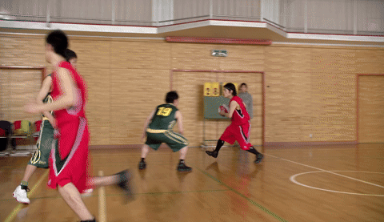
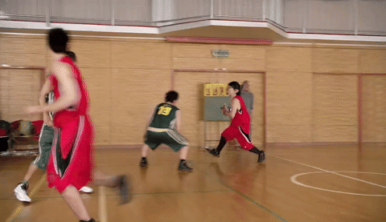
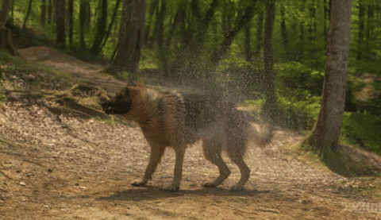
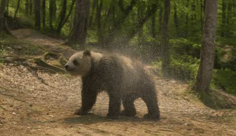

# Compression as Adaptation: Implicit Visual Representation with Diffusion Foundation Models

<p align="center">
  
  <a href="https://arxiv.org/abs/2603.07615"></a>
  <a href="https://compressionasadaptation.github.io/"></a>
</p>

This is the official code repository for the paper 

**[Compression as Adaptation: Implicit Visual Representation with Diffusion Foundation Models](https://arxiv.org/abs/2603.07615)**.


*University of Cambridge, Microsoft Research Asia*


## TL;DR

**A single vector (1x131072) is enough to represent a 480p, 81-frame video!**

## Visual Results

### Video Compression

480p video compression at 11.8KB/s (30fps).

**Ground Truth** | **VOV (Ours)**

 

### Beyond Compression: Editing

Native video editing with T2V model.

**Original** | **Edited**

 

> For more visual results and interactive demos, visit our [project page](https://compressionasadaptation.github.io/).

## Abstract

Modern visual generative models acquire rich visual knowledge through large-scale training, yet existing visual representations (such as pixels, latents, or tokens) remain external to the model and cannot directly exploit this knowledge for compact storage or reuse. In this work, we introduce a new visual representation framework that encodes a signal as a function, which is parametrized by low-rank adaptations attached to a frozen visual generative model. Such implicit representations of visual signals, e.g., an 81-frame video, can further be hashed into a single compact vector, achieving strong perceptual video compression at extremely low bitrates. Beyond basic compression, the functional nature of this representation enables inference-time scaling and control, allowing additional refinement on the compression performance. More broadly, as the implicit representations directly act as a function of the generation process, this suggests a unified framework bridging visual compression and generation.

## Code Structure

```
VisionAsAdaptations/
├── image/                          # Image pipeline (Qwen-Image)
│   ├── train_lora_multi.py         # Multi-GPU LoRA training
│   ├── reconstruct_lora_multi.py   # Reconstruction from LoRA weights
│   ├── config_train.py             # Training argument parser
│   ├── data_utils.py               # Data loading & preprocessing
│   ├── unilora_utils.py            # LoRA injection helpers
│   ├── pipelines/                  # Qwen-Image diffusion pipeline
│   ├── unilora/                    # UniLoRA layer & model implementation
│   └── descriptions/               # Image caption files
│
└── video/                          # Video pipeline (Wan2.1)
    ├── train/                      # Two-stage training
    │   ├── stage1_vm/              #   Stage 1: Visual-Memory style overfitting
    │   └── stage2_vs/              #   Stage 2: Rate-distortion with entropy term
    ├── scaling/                    # Inference-time scaling reconstruction
    ├── edit/                       # Caption editing & LoRA merging
    └── eval/                       # Evaluation (PSNR, DISTS, LPIPS, FVD)
```

Each subdirectory contains its own `README.md` with detailed environment setup and usage instructions.

## Getting Started

### Image Pipeline

```bash
cd image
pip install -r requirements.txt

# Training (multi-GPU)
DATA_ROOT=/path/to/images \
CACHE_DIR=/path/to/pretrained_models \
bash train_multi.sh

# Reconstruction
INIT_LORA_PATH=/path/to/lora_checkpoint.safetensors \
DATA_ROOT=/path/to/images \
CACHE_DIR=/path/to/pretrained_models \
bash reconstruct_multi.sh
```

See [`image/README.md`](image/README.md) for full details on environment variables (`NUM_GPUS`, `OUT_DIR`, `DESCRIPTION_FILE`, `WIDTH`, `HEIGHT`, etc.).

### Video Pipeline

```bash
cd video
pip install -r requirements.txt
```

**Training** (two-stage):

```bash
cd train

# Stage 1 — Visual-Memory style single-video overfitting
FRAMES_DIR=/path/to/frames \
CAPTION_FILE=/path/to/caption.txt \
CACHE_DIR=/path/to/pretrained_models \
bash stage1_train.sh

# Stage 2 — Rate-distortion with entropy coding
INIT_LORA_PATH=/path/to/stage1_checkpoint.safetensors \
FRAMES_DIR=/path/to/frames \
CAPTION_FILE=/path/to/caption.txt \
CACHE_DIR=/path/to/pretrained_models \
bash stage2_train.sh

# Or run both stages sequentially
bash run_two_stage.sh
```

**Inference-time scaling**:

```bash
cd scaling
bash sample.sh
```

**Editing** (caption change or LoRA merge):

```bash
cd edit
# Same LoRA, new caption
WEIGHTS=/path/to/lora.safetensors CAPTION="new prompt" bash edit_caption.sh

# Merge two LoRAs
WEIGHTS1=/path/to/lora1.safetensors WEIGHTS2=/path/to/lora2.safetensors \
CAPTION="new prompt" bash edit_merge.sh
```

**Evaluation**:

```bash
cd eval
bash eval.sh
```

See [`video/README.md`](video/README.md) and each subfolder's README for full configuration options.

## Citation

If you find this work useful, please cite:

```bibtex
@misc{he2026compressionadaptationimplicitvisual,
      title={Compression as Adaptation: Implicit Visual Representation with Diffusion Foundation Models},
      author={Jiajun He# and Zongyu Guo# and Zhaoyang Jia and Xiaoyi Zhang and Jiahao Li and Xiao Li and Bin Li and José Miguel Hernández-Lobato and Yan Lu},
      year={2026},
      eprint={2603.07615},
      archivePrefix={arXiv},
      primaryClass={cs.LG},
      url={https://arxiv.org/abs/2603.07615},
}
```
